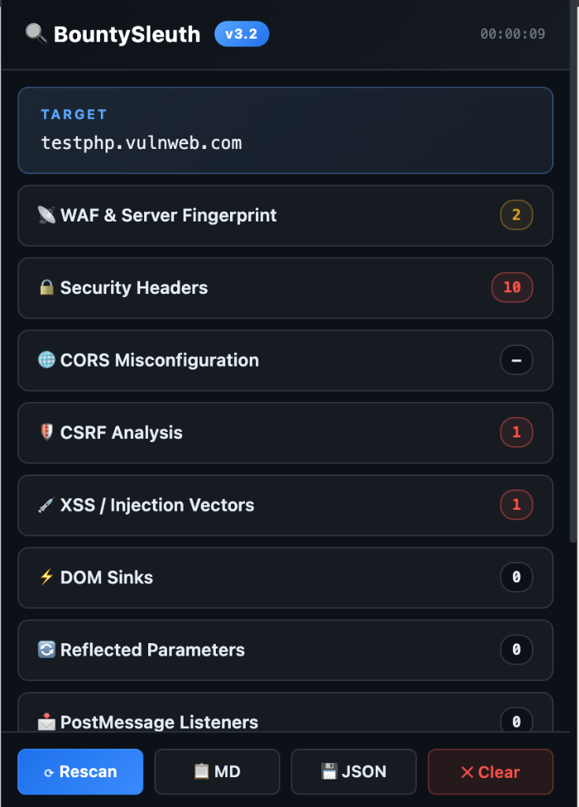
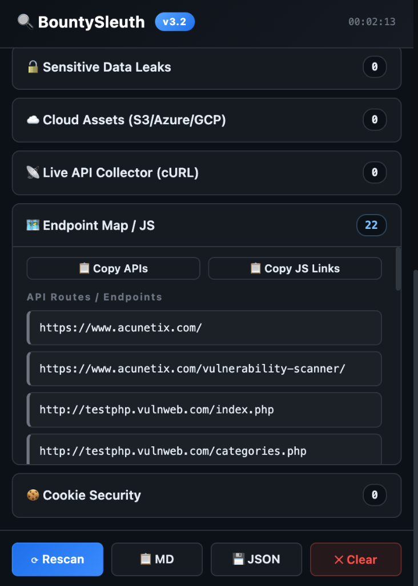

# 🔍 BountySleuth - Web Sec Analyzer

**BountySleuth** is a professional bug bounty companion and universal web security scanner available as a browser extension for both Chrome and Firefox. It passively monitors and actively analyzes web applications for common vulnerabilities, misconfigurations, and sensitive data exposures while you browse.

> **Developed by [Security0x0 Research And Development Private Limited](mailto:contact@secuirty0x0.com)**

|               Dashboard Explorer                |             Analysis & Endpoints              |
| :---------------------------------------------: | :-------------------------------------------: |
|  |  |

## 🚀 Features

BountySleuth performs real-time analysis across multiple attack vectors:

* **📡 WAF & Server Fingerprint**: Detects Web Application Firewalls (Cloudflare, Akamai, Sucuri, AWS, etc.) and server technologies.
* **🔒 Security Headers**: Analyzes headers for misconfigurations (missing CSP, HSTS, X-Frame-Options, etc.).
* **🌐 CORS Misconfiguration**: Checks for wildcard origins and credentials allowed, identifying potential cross-origin data leaks.
* **💉 Host Header Injection**: Automatically analyzes requests for Host Header vulnerabilities by injecting common payloads and monitoring responses.
* **🛡️ CSRF Analysis**: Detects forms without proper CSRF protection, analyzing tokens in hidden inputs, meta tags, and global variables. Includes weak token detection and static token analysis.
* **💉 XSS / HTMLi Analysis**: Evaluates and highlights input fields based on constraints (maxlength, patterns) and detects real-time reflections in the DOM.
* **⚡ DOM Sinks**: Scans inline scripts for dangerous sinks (`innerHTML`, `eval`, `document.write`) interacting with user-controllable sources.
* **🔄 Reflected Parameters**: Automatically catches parameters reflected in the HTML body, scripts, or attributes and assesses severity.
* **📩 PostMessage Listeners**: Inspects `postMessage` event listeners for insecure origins or dangerous handlers.
* **🔓 Sensitive Data Leaks**: Extracts over 40 types of exposed secrets, tokens, API keys (AWS, GCP, Azure, Stripe, GitHub, etc.), and private keys from the page source.
* **☁️ Cloud Infrastructure**: Identifies cloud assets, storage buckets (S3, Azure Blob, GCP Storage), and signed URLs exposed in the application.
* **📡 Live API Collector (cURL)**: Intercepts background XHR and Fetch requests, automatically generating ready-to-use cURL commands for deeper API testing.
* **🗺️ Endpoint Map / JS**: Automatically maps discovered API routes and JavaScript files for easy extraction.
* **🗺️ Source Map Detector & Unpacker**: Discovers exposed JavaScript/CSS source maps (`.map` files), validates accessibility, analyzes frameworks, and enables **one-click ZIP download** of fully reconstructed original source code (`src_unpacked/`).
* **📦 NPM Package Analyzer**: Extracts npm packages from source maps and checks against the npm registry for **Dependency Confusion / Private Package Takeover** vulnerabilities. Flags unscoped private packages as CRITICAL takeover targets.
* **💾 Cache Security**: Comprehensive cache header analysis with 14+ security checks including:
  - **Web Cache Deception** (6 attack patterns): basic extension, delimiter-based (`~;:#!@`), encoded path (`%2e%2e`), double path (`/account.php/poc.css`), query param trick, wildcard suffix
  - Cache Poisoning via unkeyed headers (X-Forwarded-Host, X-Original-URL, X-Forwarded-Path, etc.)
  - X-Cache HIT on sensitive endpoints
  - Public caching on sensitive endpoints
  - Missing no-store/must-revalidate directives
  - CDN misconfiguration detection
* **🔗 Subresource Integrity (SRI)**: Supply chain security scanner detecting:
  - 3rd party CDN scripts without integrity hashes
  - ES Modules without SRI
  - Dynamic script loading patterns
  - Service Workers/Web Workers from external sources
  - Import maps pointing to 3rd party
  - Iframes without sandbox restrictions
  - CSS @import from external sources
* **🍪 Cookie Security**: Flags insecure session cookies (e.g., missing HttpOnly or Secure flags).

## 🛠️ Installation

### Google Chrome
1. Open Chrome and navigate to `chrome://extensions/`.
2. Enable **Developer mode** in the top right corner.
3. Click on **Load unpacked**.
4. Select the `chrome_bounty_extension` folder from this repository.

### Mozilla Firefox
1. Open Firefox and navigate to `about:debugging#/runtime/this-firefox`.
2. Click on **Load Temporary Add-on...**.
3. Select the `manifest.json` file inside the `firefox_bounty_extension` folder.

## 📋 Usage

1. Click on the 🔍 BountySleuth icon in your browser extension toolbar to open the analyzer dashboard.
2. The extension badge will display the total number of findings (Red for high severity/count, Orange for medium/low).
3. Browse your target application. BountySleuth will passively analyze headers, scripts, and requests in the background.
4. Interact with the application to populate the **Live API Collector** and **XSS** modules.
5. Export your findings seamlessly using the **📋 MD** (Markdown) or **💾 JSON** buttons in the extension popup for your vulnerability reports.

## 📚 Learning Resources

BountySleuth detects vulnerabilities that can lead to real bug bounty payouts. Here are resources to learn more:

### Host Header Injection
- [PortSwigger Host Header Injection Labs](https://portswigger.net/web-security/host-header) — Free interactive labs

### Cache Poisoning & Cache Deception
- [PortSwigger Web Cache Poisoning Labs](https://portswigger.net/web-security/web-cache-poisoning) — Free interactive labs
- [PortSwigger Web Cache Deception Labs](https://portswigger.net/web-security/web-cache-deception) — Hands-on practice
- [Gotta Cache 'em All - Black Hat 2024](https://portswigger.net/research/gotta-cache-em-all) — James Kettle's research
- [HackTricks - Cache Deception](https://book.hacktricks.xyz/pentesting-web/cache-deception) — Cheatsheet

### Subresource Integrity (SRI) & Supply Chain
- [MDN - Subresource Integrity](https://developer.mozilla.org/en-US/docs/Web/Security/Defenses/Subresource_Integrity) — Official documentation
- [OWASP SRI Guide](https://owasp.org/www-community/controls/SubresourceIntegrity) — Best practices

### Dependency Confusion
- [Dependency Confusion - Alex Birsan](https://medium.com/@alex.birsan/dependency-confusion-4a5d60fec610) — Original research ($130k+ in bounties)

### YouTube Channels for Bug Bounty
- [LiveOverflow](https://youtube.com/@LiveOverflow) — Deep technical web hacking
- [PwnFunction](https://youtube.com/@PwnFunction) — Animated vulnerability explanations
- [NahamSec](https://youtube.com/@NahamSec) — Bug bounty hunting & recon
- [InsiderPhD](https://youtube.com/@InsiderPhD) — Beginner-friendly methodology

## 📦 Releases

Pre-compiled files for both Google Chrome and Mozilla Firefox are available in the [Releases](https://github.com/sagarbanwa/BountySleuth/releases) section of this repository.

## 📬 Contact

**Security0x0 Research And Development Private Limited**  
📧 Email: [contact@secuirty0x0.com](mailto:contact@secuirty0x0.com)  
🐦 Twitter: [x.com/sagarbanwa](https://x.com/sagarbanwa)

## 📝 Changelog

### v3.6.6 — Host Header Injection & Source Map Fixes
- ✨ **New: Host Header Injection** — Automatically analyzes requests for Host Header vulnerabilities by injecting common payloads and monitoring responses.
- 🐛 **Fix: Enhanced Source Map Unpacker** — Fixed compatibility issues with Chrome-based source maps, ensuring more robust one-click ZIP downloads of frontend directory structures.

### v3.6.5 — Advanced Web Cache Deception Detection
- ✨ **Enhanced: Web Cache Deception** — Now detects 6 advanced attack patterns:
  - **Basic extension**: `/profile.css`, `/account.js`
  - **Delimiter-based**: `/account~style.css`, `/profile;v2.js`, `/dashboard#section.css`
  - **Encoded path traversal**: `/settings/%2e%2e/images/logo.png`, `%5c`, `%2f`
  - **Double path confusion**: `/account.php/poc.css`
  - **Query param trick**: `/profile.js?test=123`, `/account.css?v=1`
  - **Wildcard/suffix**: `/account.js/*`, `/profile.css/anything`
- 🔧 **Additional poisonable headers**: X-Forwarded-Path, X-HTTP-Method-Override, X-Forwarded-Prefix, X-Amz-Website-Redirect-Location

### v3.6 — Cache Security & SRI Scanner (Expert Edition)
- ✨ **Enhanced: Cache Security Analysis** — Now with 14 comprehensive checks:
  - Web Cache Deception detection (sensitive URLs with static extensions)
  - Cache Poisoning via unkeyed headers (X-Forwarded-Host, X-Original-URL, X-Rewrite-URL)
  - X-Cache/CF-Cache-Status HIT detection on sensitive endpoints
  - Missing must-revalidate directive
  - Immutable directive misuse on dynamic content
  - ETag/Last-Modified timing attack vectors
  - Age header analysis for stale cached content
  - Pragma header without Cache-Control
- ✨ **Enhanced: SRI Scanner** — Now with 10+ supply chain security checks:
  - crossorigin attribute WITHOUT integrity (suspicious pattern)
  - Weak integrity hashes (SHA-256 vs SHA-384/512)
  - ES Modules from 3rd party without SRI
  - Preload/Prefetch links without integrity
  - 3rd party iframes without sandbox
  - Web Workers & Service Workers from external URLs
  - Import maps pointing to 3rd party origins
  - CSS @import loading external stylesheets
- 🔧 **Improved: Additional CDN detection** (Tailwind, FontAwesome, CKEditor, TinyMCE, Quill)

### v3.5 — NPM Package Analyzer & Enhanced CSRF Detection
- ✨ **New: NPM Package Analyzer** — Extracts packages from source maps and checks npm registry for Dependency Confusion vulnerabilities
- ✨ **New: Private Package Takeover Detection** — Flags unscoped private packages as CRITICAL (anyone can register on npm!)
- ✨ **New: Cache Security Module** — Analyzes Cache-Control headers for security misconfigurations
- ✨ **New: Subresource Integrity (SRI) Scanner** — Detects 3rd party resources without integrity hashes
- 🔧 **Improved: CSRF Analysis** — Now detects weak tokens (short length, low entropy, timestamps, static tokens across forms)
- 🔧 **Improved: Sensitive action flagging** — Highlights login/payment/admin forms without CSRF protection
- 🐛 **Fix: False positives** — Filtered build tool artifacts (.pnpm, .federation, webpack internals) from npm analysis

### v3.4 — Source Map Unpacker & Bug Fixes
- ✨ **New: Source Map Unpacker (📦 Unpack ZIP)** — Reconstructs full original source directories from `.map` files and downloads them as a structured `.zip` with a `src_unpacked/` root folder.
- 🐛 **Fix: ZIP download now works** — Replaced `FileReader.readAsDataURL()` with `URL.createObjectURL()` for Manifest V3 service worker compatibility.
- 🐛 **Fix: Unpack ZIP button always visible** — Removed conditional display logic that hid the button when analysis data wasn't available.
- 🐛 **Fix: CSS source maps now fully analyzed** — Enabled deep content analysis for CSS `.map` files (previously skipped).
- 🐛 **Fix: Release ZIP corruption** — Added `.gitattributes` binary markers to prevent Git from corrupting ZIP files.
- 🏷️ **Branding: Security0x0 Research And Development Private Limited** — Added developer attribution and contact email across all UI elements.

### v3.3 — Source Map Detector
- ✨ Advanced source map discovery (JS, CSS, HTTP headers, webpack/Next.js/Nuxt probing)
- ✨ Deep analysis: framework detection, source count, embedded code leak warnings
- ✨ One-click download of individual `.map` files
- 🐛 Fixed release ZIP corruption via `.gitattributes`

## ⚠️ Disclaimer

This tool is intended for **educational purposes and authorized security testing only**. Do not use BountySleuth on systems you do not own or have explicit permission to test.
